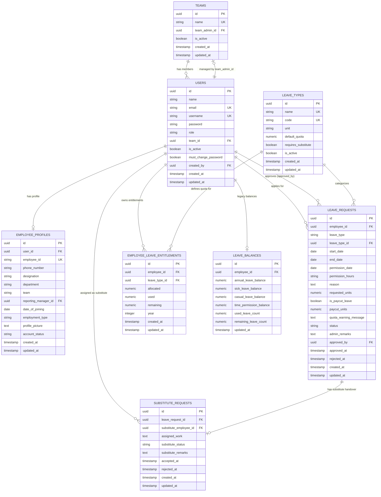

# Database Design & Schema Documentation

## 1. Overview

The **Leave Management Database** is a relational PostgreSQL database schema utilizing PostgreSQL UUID generation (`uuid-ossp`), foreign key constraints, cascading rules, unique indices, and check constraints to guarantee complete data integrity.

---

## 2. Entity-Relationship Diagram (ERD)

---

## 3. Detailed Table Documentation

### 3.1 `teams` Table
Stores company departments and team units.
- `id` (UUID, Primary Key, Default: `uuid_generate_v4()`)
- `name` (VARCHAR 255, Unique, Not Null): Team name (e.g. *Engineering*, *Sales*, *HR*).
- `team_admin_id` (UUID, Foreign Key $\rightarrow$ `users.id`, Nullable): Assigned Team Lead manager.
- `is_active` (BOOLEAN, Default: `true`): Soft deletion flag.
- `created_at`, `updated_at` (TIMESTAMPTZ)

### 3.2 `users` Table
Core authentication and authorization entity.
- `id` (UUID, Primary Key, Default: `uuid_generate_v4()`)
- `name` (VARCHAR 255, Not Null): Employee's full name.
- `email` (VARCHAR 255, Unique, Not Null): Corporate email address.
- `username` (VARCHAR 100, Unique, Not Null): Unique login username.
- `password` (VARCHAR 255, Not Null): Bcrypt password hash.
- `role` (VARCHAR 50, Not Null, Check: `employee`, `admin`, `team_admin`, `superior_admin`).
- `team_id` (UUID, Foreign Key $\rightarrow$ `teams.id`, Nullable).
- `is_active` (BOOLEAN, Default: `true`): Active status flag.
- `must_change_password` (BOOLEAN, Default: `true`): Force password change flag.
- `created_by` (UUID, Foreign Key $\rightarrow$ `users.id`, Nullable): Admin who created the user.
- `created_at`, `updated_at` (TIMESTAMPTZ)

### 3.3 `employee_profiles` Table
Extended job profile and organizational metadata.
- `id` (UUID, Primary Key, Default: `uuid_generate_v4()`)
- `user_id` (UUID, Foreign Key $\rightarrow$ `users.id` ON DELETE CASCADE, Not Null)
- `employee_id` (VARCHAR 100, Unique, Not Null): Staff ID (e.g. `EMP-1002`).
- `designation` (VARCHAR 100): Job title (e.g. *Senior Frontend Engineer*).
- `department` (VARCHAR 100): Functional department.
- `reporting_manager_id` (UUID, Foreign Key $\rightarrow$ `users.id`, Nullable)
- `employment_type` (VARCHAR 100): e.g. *Full Time*, *Contract*.
- `account_status` (VARCHAR 50, Default: `'active'`)

### 3.4 `leave_types` Table
Defines available leave policies, quotas, and measurement units.
- `id` (UUID, Primary Key, Default: `uuid_generate_v4()`)
- `name` (VARCHAR 255, Unique, Not Null): e.g. *Annual Leave*, *Time Permission*.
- `code` (VARCHAR 100, Unique, Not Null): e.g. `ANNUAL`, `TIME_PERMISSION`.
- `unit` (VARCHAR 50, Not Null, Check: `'days'`, `'hours'`)
- `default_quota` (NUMERIC 5,2, Default: `0`): Standard annual quota allowance.
- `requires_substitute` (BOOLEAN, Default: `true`): Substitute mandate toggle.
- `is_active` (BOOLEAN, Default: `true`): Active leave policy toggle.

### 3.5 `employee_leave_entitlements` Table
Tracks individual annual quota balances per employee per leave type.
- `id` (UUID, Primary Key, Default: `uuid_generate_v4()`)
- `employee_id` (UUID, Foreign Key $\rightarrow$ `users.id` ON DELETE CASCADE, Not Null)
- `leave_type_id` (UUID, Foreign Key $\rightarrow$ `leave_types.id` ON DELETE CASCADE, Not Null)
- `allocated` (NUMERIC 5,2, Default: `0`): Allocated units for the year.
- `used` (NUMERIC 5,2, Default: `0`): Approved used units.
- `remaining` (NUMERIC 5,2, Default: `0`): Remaining quota balance ($\text{allocated} - \text{used}$).
- `year` (INTEGER, Default: Current Year): Quota year.
- **Unique Constraint**: `(employee_id, leave_type_id, year)`

### 3.6 `leave_requests` Table
Records leave and time permission applications.
- `id` (UUID, Primary Key, Default: `uuid_generate_v4()`)
- `employee_id` (UUID, Foreign Key $\rightarrow$ `users.id` ON DELETE CASCADE, Not Null)
- `leave_type` (VARCHAR 50, Not Null): Leave policy name.
- `leave_type_id` (UUID, Foreign Key $\rightarrow$ `leave_types.id` ON DELETE SET NULL)
- `start_date`, `end_date` (DATE): Requested date range for full/half day leaves.
- `permission_date` (DATE): Selected date for Time Permission.
- `permission_hours` (VARCHAR 50): `'1 hour'`, `'2 hours'`, or `'3 hours'`.
- `reason` (TEXT, Not Null): Reason for request.
- `requested_units` (NUMERIC 5,2, Default: `0`): Calculated duration in days or hours.
- `is_paycut_leave` (BOOLEAN, Default: `false`): Quota overdraft flag.
- `paycut_units` (NUMERIC 5,2, Default: `0`): Overdraft units exceeding remaining quota.
- `quota_warning_message` (TEXT): Quota warning alert details.
- `status` (VARCHAR 50, Default: `'Waiting for Substitute Approval'`): Status enum (`'Waiting for Substitute Approval'`, `'Waiting for Admin Approval'`, `'Approved'`, `'Rejected'`).
- `admin_remarks` (TEXT): Remarks provided during rejection/approval.
- `approved_by` (UUID, Foreign Key $\rightarrow$ `users.id`, Nullable): Approving manager.
- `approved_at`, `rejected_at`, `created_at`, `updated_at` (TIMESTAMPTZ)

### 3.7 `substitute_requests` Table
Manages peer substitute handover approvals.
- `id` (UUID, Primary Key, Default: `uuid_generate_v4()`)
- `leave_request_id` (UUID, Foreign Key $\rightarrow$ `leave_requests.id` ON DELETE CASCADE, Not Null)
- `substitute_employee_id` (UUID, Foreign Key $\rightarrow$ `users.id` ON DELETE CASCADE, Not Null)
- `assigned_work` (TEXT, Not Null): Handover instructions and pending duties.
- `substitute_status` (VARCHAR 50, Default: `'Pending'`, Check: `'Waiting for Substitute Approval'`, `'Pending'`, `'Accepted'`, `'Rejected'`)
- `substitute_remarks` (TEXT): Remarks provided by substitute upon rejection.
- `accepted_at`, `rejected_at`, `created_at`, `updated_at` (TIMESTAMPTZ)

### 3.8 `leave_balances` Table (Legacy Backward Compatibility)
Maintains backward compatibility for legacy leave balance tracking queries.
- `id` (UUID, Primary Key, Default: `uuid_generate_v4()`)
- `employee_id` (UUID, Foreign Key $\rightarrow$ `users.id` ON DELETE CASCADE, Not Null)
- `annual_leave_balance`, `sick_leave_balance`, `casual_leave_balance`, `time_permission_balance` (NUMERIC 5,2)
- `used_leave_count`, `remaining_leave_count` (NUMERIC 5,2)
