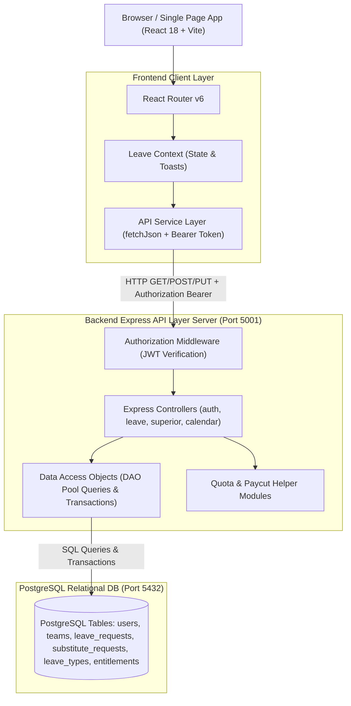

# Technical Architecture Documentation

## 1. Architecture Overview

The **Leave Management Web Application** is built using a modern decoupled client-server architecture:
- **Frontend**: Single Page Application (SPA) built with React 18, Vite, React Router DOM, and custom 2026 SaaS CSS design tokens.
- **Backend**: RESTful API server powered by Node.js, Express.js (ES Modules), PostgreSQL client connection pooling (`pg`), and JWT authorization middleware.
- **Database**: Relational PostgreSQL database featuring UUID primary keys, foreign key constraints, atomic transactions, and automated timestamp triggers.



---

## 2. Technology Stack

### Frontend Architecture
- **Core**: React 18 (Functional components, Hooks: `useState`, `useEffect`, `useCallback`, `useContext`)
- **Build Tool**: Vite 8.2.2 (Fast HMR, production bundling)
- **Routing**: `react-router-dom` v6 with role-based Route Guards (`RequireAuth`, `RequireTeamAdmin`, `RequireSuperiorAdmin`, `RequireNonSuperior`)
- **Styling**: Vanilla CSS3 using custom CSS design tokens (`#0F172A`, `#4F46E5`, `#10B981`, `#06B6D4`, `#F59E0B`, `#EF4444`) with responsive Flexbox/Grid systems, glassmorphism, and smooth micro-animations.
- **Icons**: `lucide-react`
- **Linting & Code Quality**: `oxlint` (Zero warnings, zero errors enforced)

### Backend Architecture
- **Runtime**: Node.js v18+ (Native ES Modules `"type": "module"`)
- **Framework**: Express.js 4.x
- **Database Client**: `pg` (node-postgres Connection Pool)
- **Security & Authentication**:
  - `bcryptjs` for salt-based password hashing (10 rounds)
  - `jsonwebtoken` (JWT) for stateless session token generation and verification
  - `cors` for cross-origin request handling
- **Configuration**: `dotenv` for environment variable loading (`.env`)

---

## 3. Project Directory Structure

```
leave-management-app/
├── backend/
│   ├── src/
│   │   ├── config/
│   │   │   ├── db.js                              # PostgreSQL connection pool configuration
│   │   │   ├── schema.sql                         # Base database schema definitions
│   │   │   ├── seed.sql                           # Seed data for initial users, teams, and entitlements
│   │   │   ├── auth_user_management_migration.sql # User management migration script
│   │   │   ├── configuration_management_migration.sql # Teams, Leave Types & Entitlements migration
│   │   │   ├── paycut_leave_migration.sql         # Paycut leave columns migration
│   │   │   └── team_workflow_migration.sql        # Team approval workflow migration
│   │   ├── controllers/
│   │   │   ├── adminController.js                 # Team Admin approval & request management
│   │   │   ├── authController.js                  # Login & password change authentication handlers
│   │   │   ├── calendarController.js              # Monthly summary & date detail calendar APIs
│   │   │   ├── leaveController.js                 # Leave submission & employee request history
│   │   │   ├── substituteController.js            # Substitute handover request actions
│   │   │   └── superiorController.js              # Superior Admin users, configuration & dashboard APIs
│   │   ├── dao/
│   │   │   ├── adminDao.js                        # Team Admin data access queries
│   │   │   ├── authDao.js                         # Authentication & user password lookup queries
│   │   │   ├── calendarDao.js                     # Calendar month & unique employee day detail queries
│   │   │   ├── leaveDao.js                        # Atomic leave creation & overlap validation queries
│   │   │   ├── substituteDao.js                   # Substitute request queries & transaction handlers
│   │   │   └── superiorDao.js                     # Superior Admin management queries
│   │   ├── middleware/
│   │   │   └── authMiddleware.js                  # JWT token verification & role enforcement middleware
│   │   ├── routes/
│   │   │   ├── adminRoutes.js                     # Routes for /api/admin
│   │   │   ├── authRoutes.js                      # Routes for /api/auth
│   │   │   ├── calendarRoutes.js                  # Routes for /api/calendar
│   │   │   ├── leaveRoutes.js                     # Routes for /api/leaves
│   │   │   ├── substituteRoutes.js                # Routes for /api/substitute-requests
│   │   │   └── superiorRoutes.js                  # Routes for /api/superior
│   │   ├── utils/
│   │   │   └── quotaHelper.js                     # Leave quota, paycut, and warning calculation logic
│   │   ├── app.js                                 # Express application setup & middleware mounting
│   │   └── server.js                              # Server startup entry point (Port 5001)
│   └── package.json
│
├── frontend/
│   ├── src/
│   │   ├── components/
│   │   │   ├── Layout.jsx                         # Main app shell (Sidebar, Header, Content Area)
│   │   │   ├── Navbar.jsx                         # Sidebar navigation with role-aware links
│   │   │   ├── StatusBadge.jsx                    # Reusable leave & substitute status badges
│   │   │   └── Toast.jsx                          # Toast notification container
│   │   ├── context/
│   │   │   ├── LeaveContext.jsx                   # Global state provider for user & toasts
│   │   │   └── useLeave.js                        # React hook for LeaveContext
│   │   ├── pages/
│   │   │   ├── AdminDashboard.jsx                 # Team Admin approval dashboard
│   │   │   ├── ApplyLeavePage.jsx                 # Leave application form with paycut modal & overlap alert
│   │   │   ├── CalendarPage.jsx                   # Monthly grid & centered date click modal
│   │   │   ├── ChangePasswordPage.jsx             # Forced password change page
│   │   │   ├── ConfigurationPage.jsx              # Superior Admin Teams, Leave Types & Quotas page
│   │   │   ├── EmployeeDashboard.jsx              # Employee personal leave overview
│   │   │   ├── EmployeeProfilePage.jsx            # User profile details page
│   │   │   ├── LoginPage.jsx                      # Sign-in page with demo credential shortcuts
│   │   │   ├── MyLeavesPage.jsx                   # Employee request history & review modal
│   │   │   ├── SubstituteRequestsPage.jsx         # Peer substitute handover approval page
│   │   │   ├── SuperiorDashboard.jsx              # Executive availability snapshot dashboard
│   │   │   └── UserManagementPage.jsx             # Superior Admin employee provisioning page
│   │   ├── services/
│   │   │   ├── api.js                             # API service client functions (fetchJson wrapper)
│   │   │   └── auth.js                            # LocalStorage user/token management & RBAC helpers
│   │   ├── utils/
│   │   │   └── dateUtils.js                       # Date calculation & formatting utilities
│   │   ├── App.css                                # Global 2026 SaaS stylesheet
│   │   ├── App.jsx                                # App routes, navigation structure, and Route Guards
│   │   └── main.jsx                               # React application entry point
│   ├── index.html
│   ├── package.json
│   └── vite.config.js
│
├── docs/                                          # Comprehensive Project Documentation
│   ├── PRODUCT_REQUIREMENTS.md
│   ├── TECHNICAL_DOCUMENTATION.md
│   ├── DATABASE_DESIGN.md
│   ├── API_DOCUMENTATION.md
│   ├── USER_ROLES_AND_WORKFLOWS.md
│   └── SETUP_GUIDE.md
└── README.md
```

---

## 4. Design Systems & Engineering Patterns

### Data Access Object (DAO) Pattern
All database queries are decoupled from Express route handlers into dedicated DAO modules in `backend/src/dao/`. This ensures:
- Clean separation of concerns.
- Reusable, parameterized SQL statements preventing SQL injection attacks.
- Atomic transaction execution (`BEGIN`, `COMMIT`, `ROLLBACK`) for multi-step operations (such as atomic leave creation + substitute request insertion).

### Stateless JWT & Role-Based Access Control (RBAC)
- Login requests return a signed JWT token containing `{ id, username, role }`.
- `authMiddleware.verifyToken` verifies the token on protected routes via `Authorization: Bearer <token>`.
- Specialized middleware functions (`requireSuperiorAdmin`, `requireTeamAdmin`) enforce role constraints at the API level.

### Date-Only Mathematical Calculation
To eliminate timezone drift and UTC shift issues across heterogeneous environments, leave start and end dates are handled as strict YYYY-MM-DD date strings. Math calculations (`calculateInclusiveDays`) use explicit integer UTC epoch math:
$$\text{diffDays} = \text{Math.round}\left(\frac{\text{UTC}_2 - \text{UTC}_1}{86,400,000}\right) + 1$$
