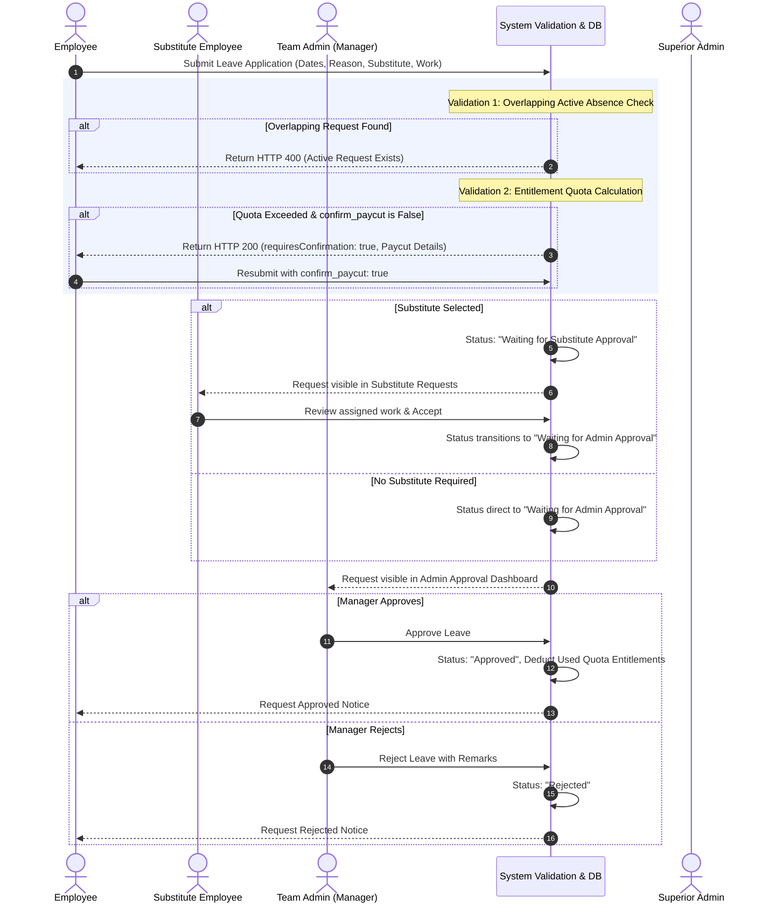
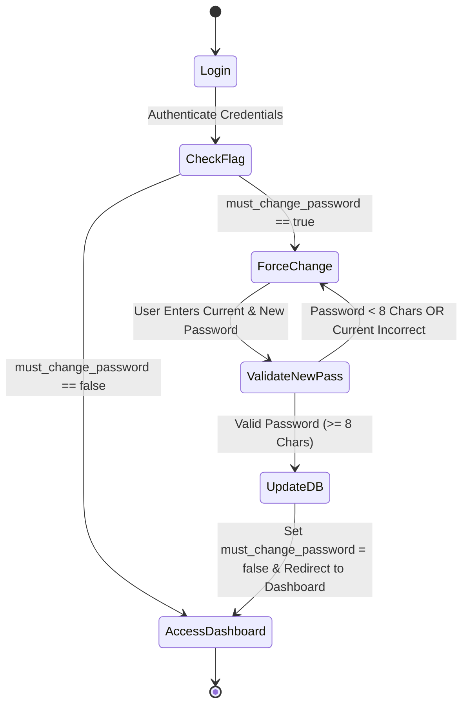

# User Roles & End-to-End Business Workflows

## 1. Overview of Workflows

The Leave Management Portal manages leave lifecycle execution through four distinct user roles, automated validation guards, peer substitute handovers, and executive oversight.

---

## 2. End-to-End Leave Approval Flow

---

## 3. Role-Specific User Workflows

### 3.1 Employee Workflow
1. **Login**: Authenticate via username/password. If `must_change_password` is true, complete password update first.
2. **Apply for Leave**:
   - Navigate to `/apply-leave`.
   - Select Leave Type (*Annual, Sick, Casual, Emergency, Half Day, Time Permission*).
   - Enter Date Range (or Permission Date & Hours).
   - Provide Reason and select Substitute Employee with mandatory Assigned Work handover notes.
   - Click **Submit Application**.
3. **Handle Quota Warning**:
   - If requested units exceed remaining quota balance, review the red warning banner (*Allocated, Used, Remaining, Requested, Paycut Units*).
   - Click **Continue Anyway** to flag request as paycut leave, or **Cancel** to modify dates.
4. **Track Status**:
   - Navigate to `/my-leaves` to track progress (*Waiting for Substitute Approval*, *Waiting for Admin Approval*, *Approved*, or *Rejected*).

### 3.2 Substitute Employee Workflow
1. **Review Pending Requests**:
   - Navigate to `/substitute-requests`.
   - View assigned handover duties, dates, and applicant details.
2. **Accept / Reject Handover**:
   - Click **Accept Handover** to confirm readiness. Request advances to Team Admin for manager approval.
   - Click **Decline** with remarks if unable to cover duties. Request updates to `Rejected`.

### 3.3 Team Admin Workflow
1. **Monitor Team Availability**:
   - Navigate to `/admin`.
   - View pending team requests, team availability metrics, and peer substitute statuses.
2. **Approve or Reject Requests**:
   - Review substitute acceptance status and handover notes.
   - Click **Approve** to authorize leave and deduct quota balance automatically.
   - Click **Reject** with mandatory remarks if coverage is insufficient.

### 3.4 Superior Admin Workflow
1. **Executive Oversight**:
   - Navigate to `/superior` dashboard.
   - View 3 primary real-time availability cards (Total Away Right Now, On Leave Today, Time Permission Today) and a separate Leave Calendar shortcut card.
   - Audit overall request summary metrics and company-wide rejected leaves.
2. **Provision Users**:
   - Navigate to `/superior/users`.
   - Add new employees with generated username and temporary password.
   - Perform password resets or account deactivations as required.
3. **Configure Company Settings**:
   - Navigate to `/superior/configuration`.
   - Manage Teams, Leave Policies, and individual Employee Leave Entitlements.

---

## 4. Calendar Access Rules

| Role | Navigation Link | Visibility Scope | Selected Date Details |
| :--- | :--- | :--- | :--- |
| **Employee** | Sidebar (`/calendar`) | Own Team Availability | Team members on leave & time permissions |
| **Team Admin** | Sidebar (`/calendar`) | Managed Team Availability | Team members on leave & time permissions |
| **Superior Admin** | Dashboard Card (`/calendar`) | Company-Wide Availability | All departments & organization-wide breakdown |

---

## 5. Force Password Change Workflow

